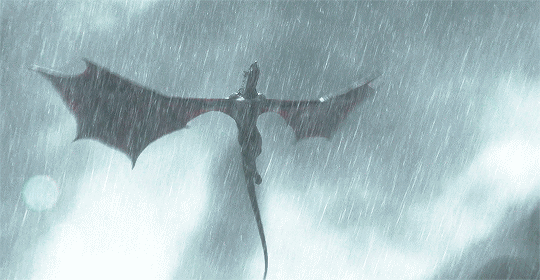

<!-- ═════════════════════════════  ESCENA DE APERTURA  ═════════════════════════════ -->

 
 

 

 
 

DISPONIBLE PARA FREELANCE Y TIEMPO COMPLETO

 

<!-- ═════════════════════════════  ACTO I — SOBRE MÍ  ═════════════════════════════ -->

<h3 align="center"><code>&nbsp;ACTO I&nbsp;</code>&nbsp;&nbsp;Sobre mí</h3>

<b>De la idea a producción, con un solo responsable.</b>

Diseño y desarrollo productos digitales completos: arquitectura backend, modelado de datos, APIs, 
aplicaciones web y móviles, y despliegue en producción. 
Trabajo con arquitectura limpia y principios SOLID para que tu software sea estable, seguro 
y fácil de evolucionar a medida que tu negocio crece. 
Cada proyecto se entrega funcionando en producción, no como un prototipo.

Además dirijo <b>Extracurricular</b>, mi estudio independiente de apps Android publicadas en Google Play.

 

<!-- ═════════════════════════════  ACTO II — TRABAJO  ═════════════════════════════ -->

<h3 align="center"><code>&nbsp;ACTO II&nbsp;</code>&nbsp;&nbsp;Proyectos destacados</h3>

 

<table>
<tr>
<td width="50%">

</td>
<td valign="top" width="50%">

#### `01` &nbsp; Differential

Asistente médico de diagnóstico diferencial con RAG. Evalúa síntomas contra **14 libros de medicina (61.440 fragmentos)** con búsqueda híbrida FAISS + BM25, fusión RRF y re-ranking cross-encoder, y entrega un diagnóstico fundamentado vía LLM. Autenticación con contraseñas cifradas, voz en español, exportación a PDF y **más de 230 pruebas** (pytest + Playwright).

`Python` · `Flask` · `FAISS` · `TypeScript` · `Vite` · `Docker`

[**Caso →**](https://portafolio-ng-gamma.vercel.app/projects/differential) &nbsp;·&nbsp; [**Código →**](https://github.com/Dev-Sot/Differential)

</td>
</tr>
<tr>
<td valign="top" width="50%">

#### `02` &nbsp; Canchazo

Marketplace deportivo para vendedores verificados del Tolima, con **pagos reales vía Wompi**. La lógica crítica del dinero (precio, stock, comisión y liquidaciones) corre en funciones **PL/pgSQL en el servidor**, no en el navegador, con Row Level Security en cada tabla sensible y actualizaciones en tiempo real.

`React` · `TypeScript` · `Supabase` · `PostgreSQL` · `Tailwind CSS`

[**Demo →**](https://tolimadeportesv2.vercel.app/marketplace) &nbsp;·&nbsp; [**Caso →**](https://portafolio-ng-gamma.vercel.app/projects/canchazo) &nbsp;·&nbsp; [**Código →**](https://github.com/Dev-Sot/canchazo)

</td>
<td width="50%">

</td>
</tr>
<tr>
<td width="50%">

</td>
<td valign="top" width="50%">

#### `03` &nbsp; Hotel Booking

Reservas de hotel en tiempo real con panel de administración por rol. **La doble reserva es imposible**: la garantiza una restricción `EXCLUDE` en PostgreSQL, no el frontend. Acceso con Google y enlace mágico, rutas protegidas en el servidor, y pruebas con Vitest y Playwright en **CI con GitHub Actions** en cada Pull Request.

`Next.js` · `TypeScript` · `Supabase` · `PostgreSQL` · `Playwright`

[**Demo →**](https://hotel-booking-gamma-red.vercel.app/) &nbsp;·&nbsp; [**Caso →**](https://portafolio-ng-gamma.vercel.app/projects/hotel-booking) &nbsp;·&nbsp; [**Código →**](https://github.com/Dev-Sot/hotel-booking)

</td>
</tr>
<tr>
<td valign="top" width="50%">

#### `04` &nbsp; Noche Sin Luna

Supervivencia zombie top-down en pixel art, en solitario o **cooperativo online de 2 a 4 jugadores** peer-to-peer por WebRTC. Nueve noches en tres mundos (ciudad, hospital y puerto) con historia y final. Motor propio con bucle de paso fijo a 60 Hz y pathfinding por campo de flujo. Sin build ni dependencias.

`JavaScript` · `HTML5 Canvas` · `WebRTC` · `Web Audio API`

[**Jugar →**](https://zombie-night.vercel.app/) &nbsp;·&nbsp; [**Caso →**](https://portafolio-ng-gamma.vercel.app/projects/noche-sin-luna) &nbsp;·&nbsp; [**Código →**](https://github.com/Dev-Sot/zombie-night)

</td>
<td width="50%">

</td>
</tr>
</table>

 

<b>Más proyectos</b>

 

| Proyecto | Descripción | Stack | Enlaces |
|:--|:--|:--|:--|
| **Aurum** | Sitio editorial para un restaurante de alta cocina, en español e inglés | React · TypeScript · Tailwind · Framer Motion | [Demo](https://aurum-restaurant-two.vercel.app/) · [Caso](https://portafolio-ng-gamma.vercel.app/projects/aurum-restaurant) · [Código](https://github.com/Dev-Sot/Aurum-Restaurant) |
| **Pixel Dash** | Plataformero en pixel art con tres islas, historia y controles táctiles | JavaScript · HTML5 Canvas | [Jugar](https://pixel-dash-nine.vercel.app/) · [Caso](https://portafolio-ng-gamma.vercel.app/projects/pixel-dash) · [Código](https://github.com/Dev-Sot/pixel-dash) |

 

<!-- ═════════════════════════════  ACTO III — ESTUDIO  ═════════════════════════════ -->

<h3 align="center"><code>&nbsp;ACTO III&nbsp;</code>&nbsp;&nbsp;Extracurricular</h3>

<i>Estudio independiente · apps Android en Google Play</i>

 

<table>
<tr>
<td width="50%" valign="top">

#### Sorbo &nbsp;

Microaprendizaje en formato feed: ideas de 60 segundos con repaso espaciado, rachas y feed personalizado. Suscripción con Google Play Billing.

`Kotlin` · `Jetpack Compose` · `Firebase`

[**Caso →**](https://portafolio-ng-gamma.vercel.app/projects/sorbo)

</td>
<td width="50%" valign="top">

#### Bloom &nbsp;

Hábitos, estado de ánimo, diario y metas en una sola app tranquila. Clean Architecture por features, datos locales reactivos y copias de seguridad sin duplicados.

`Flutter` · `Riverpod` · `Drift` · `Firebase`

[**Caso →**](https://portafolio-ng-gamma.vercel.app/projects/bloom)

</td>
</tr>
<tr>
<td width="50%" valign="top">

#### Pasavia &nbsp;

Prepara el examen teórico de conducción estudiando en tu idioma. Colombia (CALE) y cuatro estados de EE. UU., con simulacros en formato oficial y cajas de Leitner.

`Flutter` · `Riverpod` · `Drift` · `Firebase`

[**Caso →**](https://portafolio-ng-gamma.vercel.app/projects/pasavia)

</td>
<td width="50%" valign="top">

#### Zerolux &nbsp;

Fondos AMOLED sobre negro puro: motor de arte generativo propio, imágenes de la NASA y obras de dominio público, renderizados a la resolución exacta de la pantalla.

`Flutter` · `Kotlin` · `Riverpod` · `AdMob`

[**Caso →**](https://portafolio-ng-gamma.vercel.app/projects/zerolux)

</td>
</tr>
</table>

 

<!-- ═════════════════════════════  ACTO IV — STACK  ═════════════════════════════ -->

<h3 align="center"><code>&nbsp;ACTO IV&nbsp;</code>&nbsp;&nbsp;Stack</h3>

 

| | |
|:--|:--|
| **Lenguajes** |  |
| **Frontend / Mobile** |  |
| **Backend** |  |
| **Datos** |  |
| **DevOps / Herramientas** |  |

 

<!-- ═════════════════════════════  CRÉDITOS FINALES  ═════════════════════════════ -->

<h3><code>&nbsp;CRÉDITOS&nbsp;</code></h3>

DIRIGIDO, DISEÑADO Y PROGRAMADO POR 
<b>DEV-SOT</b>

 
 

<i>¿Tienes un proyecto en mente? Cuéntame qué necesitas y te respondo con una propuesta clara.</i>

 
 

<a href="mailto:sotelo.dev1@gmail.com">sotelo.dev1@gmail.com</a> &nbsp;·&nbsp;
<a href="https://portafolio-ng-gamma.vercel.app/">Portafolio</a> &nbsp;·&nbsp;
<a href="https://github.com/Dev-Sot?tab=repositories">GitHub</a>

 
 

